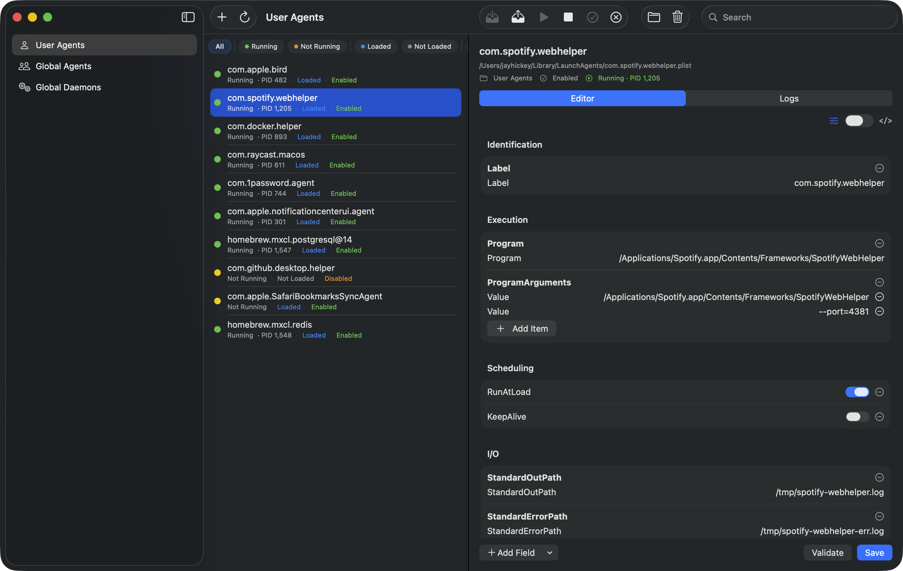

# Launchyard

A modern, native macOS app for managing launchd services. Built with SwiftUI.

  

## Features

- **Service Discovery** — View all User Agents, Global Agents, and Global Daemons at a glance
- **One-Click Controls** — Load, unload, start, stop, enable, and disable services
- **Plist Editor** — Edit service configurations with a structured form or raw XML view, with validation
- **Log Viewer** — Tail stdout/stderr logs or query the unified log for any service
- **Create & Delete** — Create new user agents from scratch or remove existing ones
- **Search & Filter** — Filter services by name, type, and runtime status

## Screenshot



## Installation

### Download

Grab the latest signed and notarized build from [Releases](https://github.com/jayhickey/Launchyard/releases/latest). Unzip and drag to Applications.

### From Source

1. Clone the repo:
   ```bash
   git clone https://github.com/jayhickey/Launchyard.git
   cd Launchyard
   ```
2. Open `Launchyard.xcodeproj` in Xcode
3. Build and run (⌘R)

### Requirements

- macOS 14 (Sonoma) or later
- Xcode 15+

## How It Works

Launchyard reads plist files from standard launchd directories:

| Location | Type |
|---|---|
| `~/Library/LaunchAgents` | User Agents |
| `/Library/LaunchAgents` | Global Agents |
| `/Library/LaunchDaemons` | Global Daemons |

Service control is performed via `launchctl` commands (`bootstrap`, `bootout`, `kickstart`, `kill`, `enable`, `disable`).

## License

MIT — see [LICENSE](LICENSE) for details.

## Contributing

Contributions are welcome! Please read [CONTRIBUTING.md](CONTRIBUTING.md) before submitting a PR.
